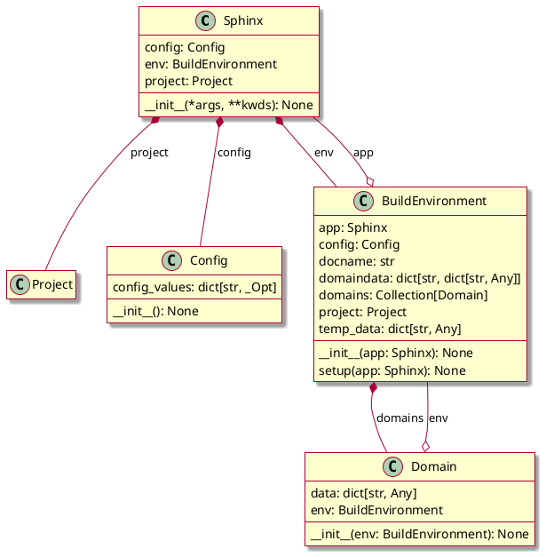
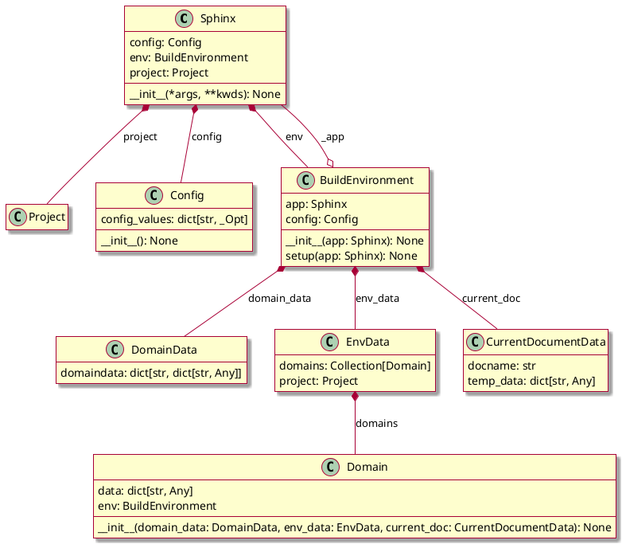

An initial attempt:

**Current**

**Proposed**

UML (current)

```plantuml
@startuml

skin rose
hide class empty members

class Sphinx {
  config: Config
  env: BuildEnvironment
  project: Project
  __init__(*args, **kwds): None
}

class Project {
}
class Config {
  config_values: dict[str, _Opt]
  __init__(): None
}
class BuildEnvironment {
  app: Sphinx
  config: Config
  docname: str
  domaindata: dict[str, dict[str, Any]]
  domains: Collection[Domain]
  project: Project
  temp_data: dict[str, Any]
  __init__(app: Sphinx): None
  setup(app: Sphinx): None
}

class Domain {
  data: dict[str, Any]
  env: BuildEnvironment
  __init__(env: BuildEnvironment): None
}

Sphinx *-- Config: config
Sphinx *-- BuildEnvironment: env
Sphinx *-- Project: project
BuildEnvironment o-- Sphinx: app

BuildEnvironment *-- Domain: domains
Domain o-- BuildEnvironment: env

@enduml
```

UML (proposed)

```plantuml
@startuml

skin rose
hide class empty members

class Sphinx {
  config: Config
  env: BuildEnvironment
  project: Project
  __init__(*args, **kwds): None
}

class Project {
}
class Config {
  config_values: dict[str, _Opt]
  __init__(): None
}
class BuildEnvironment {
  app: Sphinx
  config: Config
  __init__(app: Sphinx): None
  setup(app: Sphinx): None
}

class DomainData {
  domaindata: dict[str, dict[str, Any]]
}
class EnvData {
  domains: Collection[Domain]
  project: Project
}
class CurrentDocumentData {
  docname: str
  temp_data: dict[str, Any]
}

class Domain {
  data: dict[str, Any]
  env: BuildEnvironment
  __init__(domain_data: DomainData, env_data: EnvData, current_doc: CurrentDocumentData): None
}

Sphinx *-- Config: config
Sphinx *-- BuildEnvironment: env
Sphinx *-- Project: project
BuildEnvironment o-- Sphinx: " _app"

BuildEnvironment *-- DomainData: domain_data
BuildEnvironment *-- EnvData: env_data
BuildEnvironment *-- CurrentDocumentData: current_doc

EnvData *-- Domain: domains

@enduml
```

A